<h1 align="center">Online Shopping Application</h1>
<h3 align="center">An REST API based Online Shopping Application. It handles user authentication, products, cart, order, payment, feedback CRUD operations</h3>
 

## Modules
- Role-based User Authentication
- User Module
- Product Module
- Order Module
- Payment
- Feedback Module

 

<h2 align="left">Tech-stack</h2>
<h4 align="left">

| Techstack|Purpose |
| ------|------ |
| Spring Boot | Build Java based Spring Application |
| MySQL |Relational Database System |
| AWS RDS |Deploy RDBMS System |
| AWS ElasticStalk| Deploy RESTFull web services |
| Swagger|Simplify API Creation |
| Lombok|Annotation based getter, setter, equals, constructor |

</h4>
 

### Deployment

- [Live Project Link](/)

<h1 align="left">Screenshots</h1>

 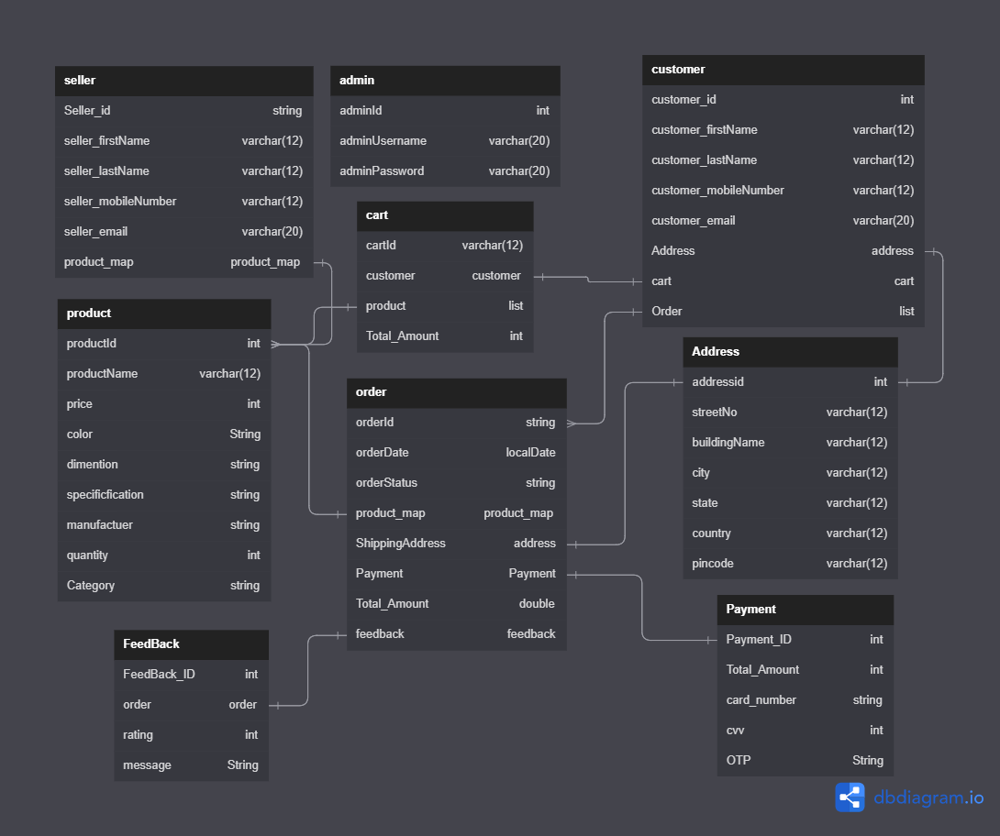 

### Admin Controller

 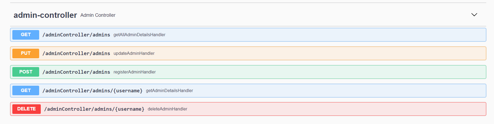 

### User Controller

 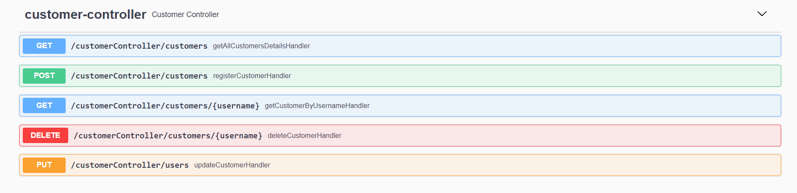 

### Login Controller

 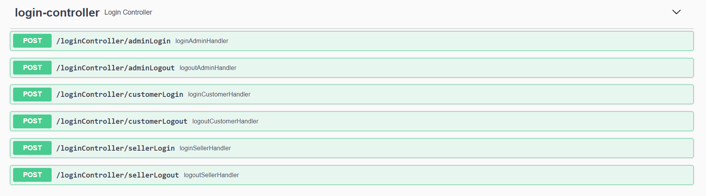 

### Product Controller

 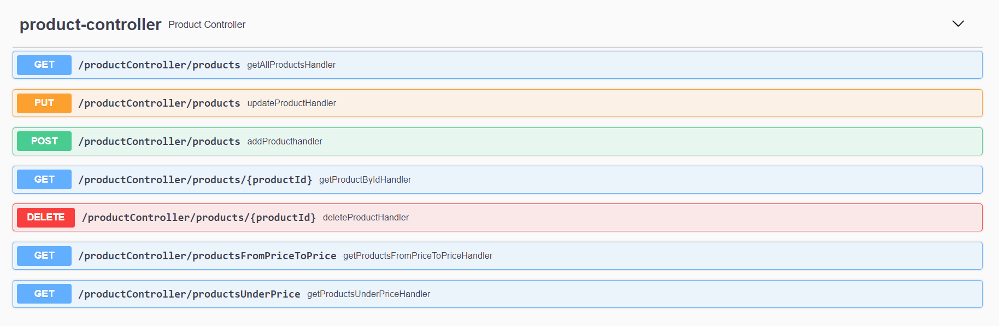 

### Product Category Controller

 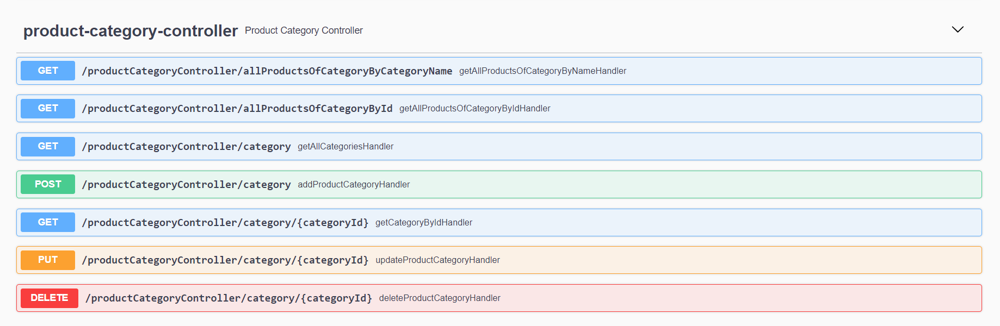 

### Cart Controller

 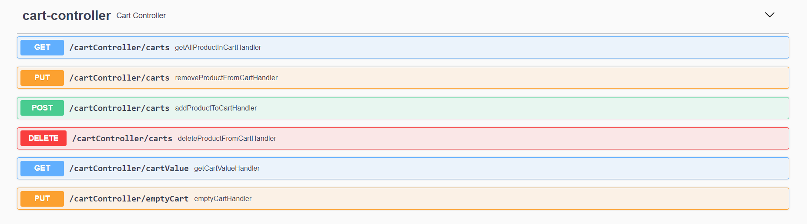 

### Order Controller

 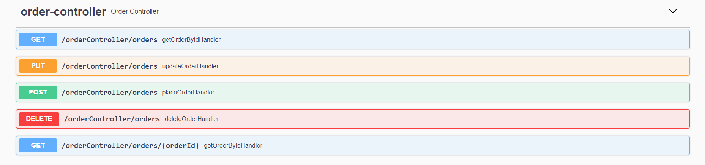 

### Payment Controller

 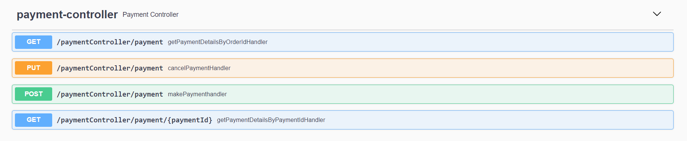 

### Sales Controller

 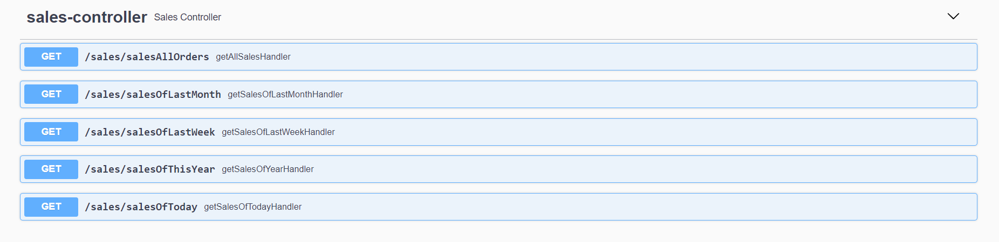 

### Feedback Controller

 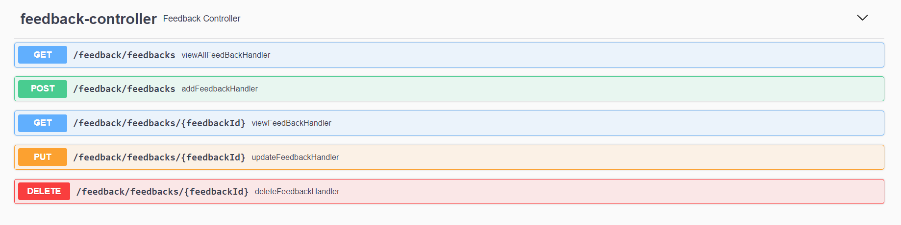 

### Card Controller

 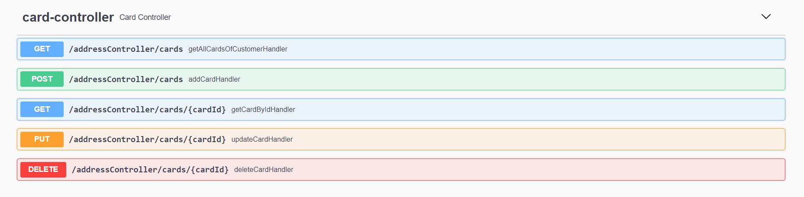 

### Address Controller

 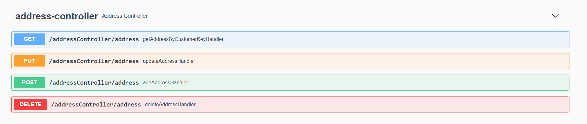 

## Authors

| Contributors|Responsibility |
| ------|------ |
| Sumit Raghav | [@sumitraghavwork](https://github.com/sumitraghavwork) |

